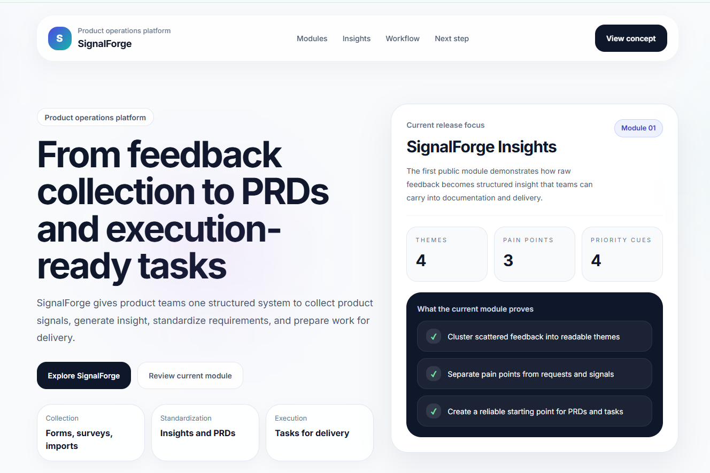

# SignalForge Insights

**Part of SignalForge**  

SignalForge Insights is a product concept for turning raw user feedback into structured product insight — as the first step in the SignalForge workflow from feedback to PRD to execution.

**Live demo:** [View the landing page](https://yasinjir.github.io/pm-feedback-analyzer-site/)

A practical product concept for helping product managers turn raw user feedback into structured, actionable insight.

## Problem
Product teams collect feedback from surveys, interviews, support tickets, and reviews, but turning that input into clear priorities is slow and messy.

## What it does
- Groups similar feedback into themes
- Extracts key pain points
- Highlights repeated feature requests
- Suggests simple priority signals

## Target users
- Product Managers
- Product Analysts
- Founders
- Growth teams

## MVP scope
- Landing page
- Raw feedback input mockup
- Structured insight output mockup
- Clear product value proposition

## Current status
Prototype stage

## Files in this repository
- `product-brief.md`
- `user-flow.md`
- `mvp-scope.md`
- `landing-copy.md`

## Prototype preview
Prototype screenshot will be added in the `assets` folder.

## Why this project exists
This project is part of a portfolio of practical product ideas and tools for modern product teams.

## Preview

